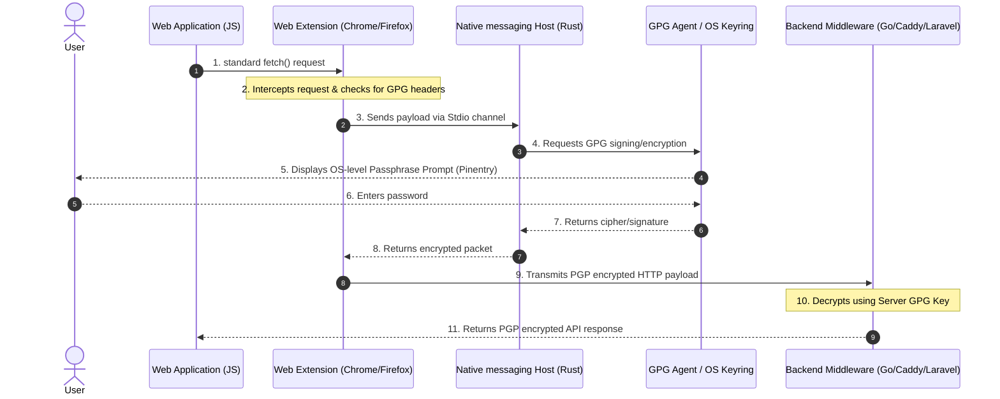

# 🛡️ Aegis HTTP

Welcome to the **Aegis HTTP** organization! 🚀

Aegis HTTP is an autonomous, **End-to-End Encrypted (E2E) HTTP gateway architecture** built on top of standard GPG (GNU Privacy Guard). It enables absolute **Zero Trust communication** between web browsers and backend servers without exposing any cryptographic material to the browser's JavaScript engine or requiring complex frontend cryptographic libraries.

---

## 🚀 How It Works (Architecture)

Aegis HTTP transparently intercepts API requests in the browser, routes them through a secure OS-level daemon to interact with GnuPG, and sends encrypted data over the network. The backend middleware decrypts it before feeding it to standard controllers.

---

## 🧩 Core Ecosystem Repositories

The Aegis HTTP ecosystem is composed of several modular building blocks:

*   **[native-host-rust](https://github.com/AegisHttp/native-host-rust)**: The native messaging daemon written in Rust that acts as a secure bridge between the browser extension and your OS GPG keyring.
*   **[google-chrome-extension](https://github.com/AegisHttp/google-chrome-extension)**: Google Chrome extension providing transparent network interception and encryption.
*   **[firefox-extension](https://github.com/AegisHttp/firefox-extension)**: Firefox extension providing gecko-compatible interception and encryption.
*   **[aegis-ts-sdk](https://github.com/AegisHttp/aegis-ts-sdk)**: TypeScript/JavaScript SDK to easily integrate authentication and tunnel controls.
*   **[caddy-module](https://github.com/AegisHttp/caddy-module)**: A plug-and-play Caddy server module that handles decryption and encryption globally at the web-server layer.
*   **[gofiber-aegis-http](https://github.com/AegisHttp/gofiber-aegis-http)**: High-performance GoFiber middleware for application-level decryption and GPG keyring handling.
*   **[aegis](https://github.com/AegisHttp/aegis)**: The official project website and documentation workspace.

---

## 🛡️ Security Safeguards

By separating cryptographic materials from the browser runtime, Aegis HTTP neutralizes critical web vulnerability vectors:

*   **XSS Key Theft Protection:** Private keys remain entirely isolated in the operating system's keyring. Injected malicious JS scripts cannot access or copy keys.
*   **Decryption Oracle Mitigation:** Requires short-lived, memory-bound session tokens generated upon explicit user interaction (via Pinentry prompts) to reject forged background decryption requests.
*   **Supply Chain Attacks Resilience:** Intercepts network calls after the DOM/JS engine formulation, rendering rogue dependency hijacking ineffective.
*   **MitM & TLS Interception Defenses:** Even in environments with compromised TLS certificates or proxies, data remains encrypted as AES-256 GPG blocks.
*   **Anti-Session Hijacking:** Uses one-time cryptographic challenges with strict idempotency and TTL temporal nonces rather than static session tokens.

---

## 🤝 Contributing

We welcome contributions across all parts of the ecosystem! Please check the individual repositories for specific issues, guidelines, and setup instructions.

If you encounter any bugs or wish to request features, please open an issue in the respective repository or in our centralized [**.github**](https://github.com/AegisHttp/.github) repository templates.
